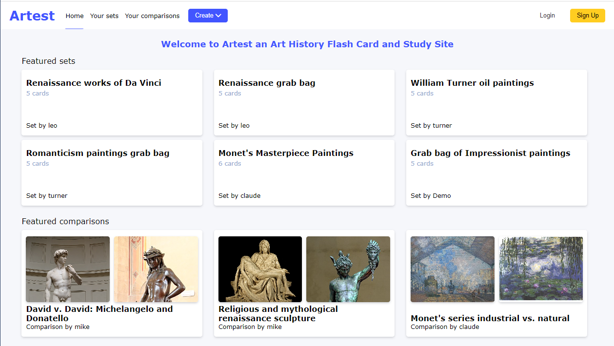

# Artest

Artest is a art history flashcard and study website inspired by Quizlet. Artest makes it easy for users to create and share flash card sets and comparison essays based on art work.

[Live Site](https://artest.onrender.com/

## Wiki Link
[Link to Wiki](https://github.com/jhpremo/Artest/wiki)
* Wiki Contains
   * Feature List
   * User Stories
   * Database Schema
   * Wire frames

## Technologies Used
* Python
* Flask
* SQLAlchemy
* Alembic
* WTForms
* Flask-Migrate
* Flask-Login
* Javascript
* Node.js
* React
* React Router
* Redux
* HTML
* CSS
* Render
* PostgreSQL
* AWS S3

## Landing Page

##  How to Launch the Application Locally
1. Clone or download the repo
2. Install dependancies:
     * run npm install in the root folder
     * cd into the app folder and run pipenv install
     * cd into the react-app folder and run npm install
3. Run pipenv shell in app folder. Run flask run in the newly opened shell.
4. Run npm start in react-app folder

## Project Creator
* Jason Premo
   * [Link to Github](https://github.com/jhpremo)
   * [Link to Linkedin](https://www.linkedin.com/in/jhpremo/)
